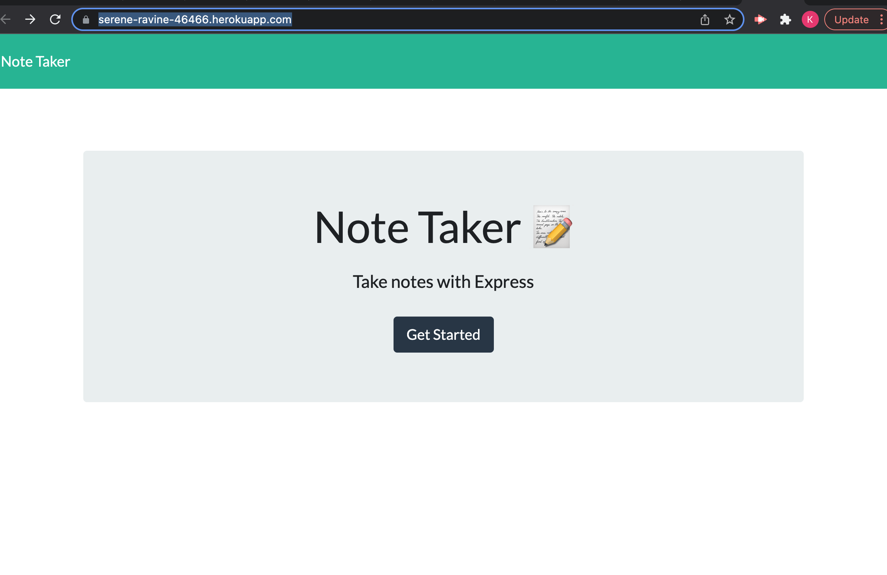
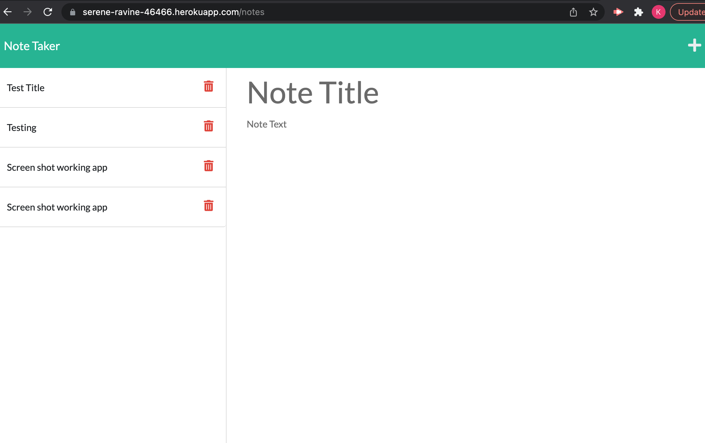

# relax-and-take-notes
It allows the user to take notes using node

[Live link to deployed Heroku](https://serene-ravine-46466.herokuapp.com/)

<!--
*** Thanks for checking out the Best-README-Template. If you have a suggestion
*** that would make this better, please fork the repo and create a pull request
*** or simply open an issue with the tag "enhancement".
*** Don't forget to give the project a star!
*** Thanks again! Now go create something AMAZING! :D
-->

<!-- PROJECT SHIELDS -->
<!--
*** I'm using markdown "reference style" links for readability.
*** Reference links are enclosed in brackets [ ] instead of parentheses ( ).
*** See the bottom of this document for the declaration of the reference variables
*** for contributors-url, forks-url, etc. This is an optional, concise syntax you may use.
*** https://www.markdownguide.org/basic-syntax/#reference-style-links
-->

### Sources

1. Heroku

2. node.js

3. JavaScript

4. Express

[Live link to Github Repository](https://github.com/kylejames20/relax-and-take-notes)